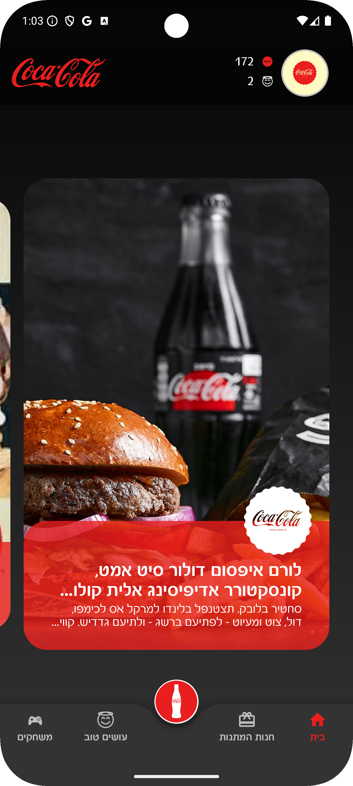

# CocaCola Android App



## Features
- Material Design 3 Bottom Navigation
- Infinite horizontal card scrolling
- Scale animations with RecyclerView

## Technical Stack
- Android SDK 33+
- Kotlin 1.9.24+
- Material Design 3
- AndroidX Libraries
- [Glide](https://github.com/bumptech/glide)

## Project Structure
```
src/
└── ui/
│   ├── base/
│   ├── activities/
│   ├── fragments/
│   ├── bottom_nav/
│   └── toolbar/
├── data/
│   ├── models/
│   └── repositories/
└── utils/
```

## Key Components

### BottomAppBar
Material Design 3 implementation featuring:
- FAB integration
- Custom navigation
- Animated transitions

### EndlessScrollAdapter
Infinite scrolling implementation with:
- Smooth scrolling behavior
- Efficient item recycling
- Scale animations
- Position tracking

```kotlin
setupEndlessScroll(realAdapter)
```

### ScaleCardAnimator
Custom animation implementation providing:
- Scale animations based on scroll position
- Smooth transitions
- Efficient calculations
